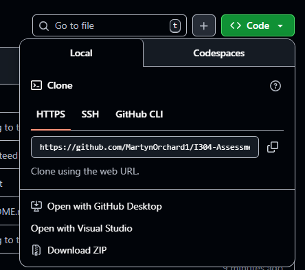

# I304 – Assessment 1
## Martyn James Orchard 

## How to run
### Step 1: Clone git/Download Zip
Clone this link: `git clone https://github.com/MartynOrchard1/I304-Assessment-1.git`

**Alternatively** you can also click the green code button on the github and download the zip


### Step 2: Install pre requisites
`pip install -r prereqs.txt`
or individually:
`pip install pandas numpy matplotlib scikit-learn scipy yfinance`

### Step 3: Run 
```bash
python Task1.py - Runs Task 1
python Task2.py - Runs Task 2
python Task3.py - Runs Task 3
python Task4.py - Runs Task 4
```
